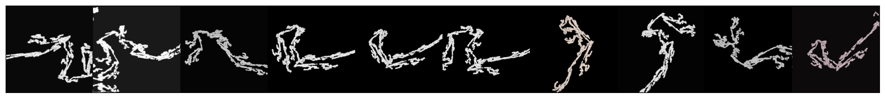

# Modules for Generating Pre-training Image Datasets Contest Solution Description

[Modules for Generating Pre-training Image Datasets Contest(Final Round)](https://signate.jp/competitions/1073/submissions)

## Environment

```
$ conda env create -f env.yml
$ conda activate submit
$ pip install -r requirements.txt
```

## Solution

- [Report](./doc/Solution.md)

- [Presentation](./doc/presentation.pdf)

## Usage

```
$ cd src
$ python main.py
```

### Generated Image Samples


