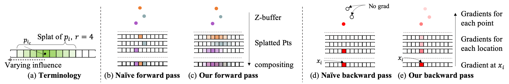
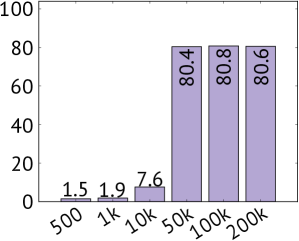
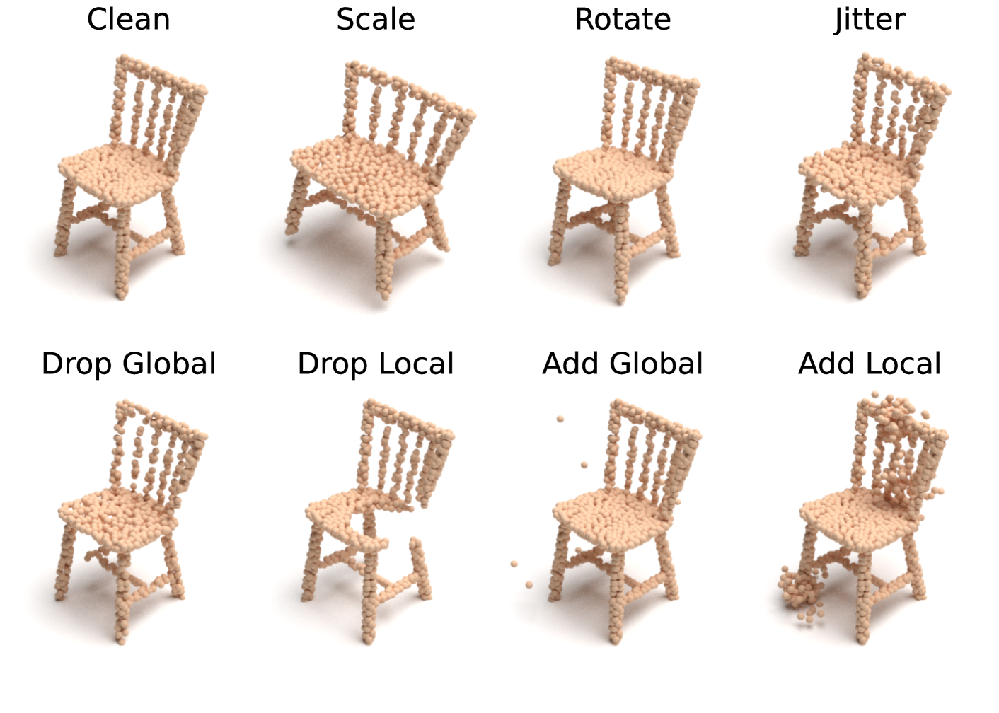
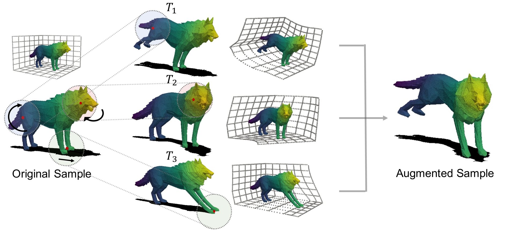

# Improving Pre-training Vision Transformers with Very Limited Synthesized Images

[事前学習用画像データセット生成モジュールコンテスト 本戦](https://signate.jp/competitions/1073/submissions)の解法

## Abstruct

R. Nakamuraらによる研究[1]は、カテゴリごとに単一のインスタンスだけを使うOne-Instance Fractal Database（OFDB）を用いた事前学習が可能であることを示している。この研究では、インスタンスの点群を回転させてレンダリングし、多様な学習データを生成する方法を採用しています。

本ソリューションは、3D-OFDBを拡張し、事前学習の効率をさらに向上させる方法を提案します。主要な改善点は以下の2点です。

1. レンダラーをOpenGLからPytorch3Dに変更し、点を球体として扱うことで、必要な点数を削減し、色の多様性を表現しやすくしました。これにより、GPUを効率的に活用し、画像生成を高速化します。
2. 点群に対する様々なデータ拡張技術（例えば、スケーリング、回転、ランダムサンプル）を組み合わせて使用し、事前学習の効率をさらに改善しました。

これらの改善により、CIFAR100の転移学習での精度比較から3D-OFDBを用いた事前学習の効率は向上することを確認しました。

## Problem Settings

各クラスに1000枚までの画像を含む、合計1000クラスからなるデータセットを作成し、事前学習の効率を改善する。事前学習はFDSLを実施し、転移先のタスクは未定でSignate上で実施される。評価指標は以下の通り、

- ファインチューニングした際の累積誤分類率

クラス数は1000クラス  
誤分類率は100-Accuracy(%)で計算される  
全体エポックの50%目~100%目までの誤分類率の累積値を最終評価値とする  

## 工夫した点・新規性

### レンダラーの変更(OpenGL -> Pytorch3D)

Pytorch3D[2]はFacebook AI Researchによって開発された微分可能な点群レンダラーで、以下のような特徴を持ちます。

- **周囲の点を考慮した色の決定**

従来の点群レンダラーは最も近い点の色を使用して画像を生成しますが、Pytorch3Dは深度情報を含む色の構成を可能にします。これはSynsin[3]で提案された方法で、勾配情報を持たせ微分可能にするためです。この特徴により、OFDBのランダムテクスチャ拡張を代替し、**立体構造を保持したまま多様なテクスチャをレンダリングが可能**にします。

    

    Figure. Comparison of our rendering pipeline to a naïve version[3].

    

    Figure. OFDB Random texture augmentation[1].

- **描画の高速化**

Pytorch3DはOpen GLに比べてコードが単純化され、GPUを効率的に使用することができます。これにより、点数が増えても高速なレンダリングが可能です。1000枚の画像を生成する際、**一枚あたりのレンダリング時間は平均5.449583ミリ秒**となりました。これは、レンダリングがボトルネックにならないことを示唆しています。また、点群の点数が異なる場合でもバッチ処理が可能であることから更に効率化が可能です。

- **球体ベース**

先行研究において、FractalDB-1kで点数を変えながらのCIFAR100の分類精度実験では、10kの点数では学習が困難であったと報告されています[4]。Pytorch3Dでは点群を球体としてレンダリングすることが可能で、半径の調整により点数を10kに減らし、成功裏に学習を行うことができました。これは、フラクタルの輪郭が破損しなかったことが一因と考えられます。

    

    Figure. Result image examples, and attention maps in point-rendered FractalDB-1k.

### 点群用データ拡張の導入

FractalDBは、IFS関数のパラメータを変更することにより、異なるインスタンスを生成しています。しかし、これは事前学習の効率を低下させる可能性があります[1]。さらに、従来は回転のみを用いたデータ拡張が行われていました[5]。ここでは、Scale、Shift、Gaussian Noise、点群の混合、点の大きさの変更、点群の色付けなど、多様なデータ拡張技術を導入しました。

- ModelNet-C[6]

    

    Figure. Examples of our ModelNet-C.

- PointWOLF[7]
  

    

    Figure. PointWOLF Framework Illustration.

## 実験

### 既存モジュールとの比較

ImageNetの事前学習した重みを使って各クラス1000枚で1000クラスのFDSLを実施し、CIFAR100でのファインチューニングによって性能を評価した。
モデルは`vit_tiny_patch16_224`を使用し、ExFractalはクラスごとの画像枚数が1000に近づくよう、view_pointを7に変更した。
exp001は、本ソリューションのベースラインであり、点数は**10k**、点群のデータ拡張はランダムなスケール変換とシフト、回転を組み合わせたものである。

| Experiment | Accuravy(%) | Memo                                                                    |
| :--------: | :---------: | :---------------------------------------------------------------------- |
|  ImageNet  |    78.85    |                                                                         |
| ExFractal  |    69.74    | https://github.com/masora1030/CVPR2022-Pretrained-ViT-PyTorch.git       |
|   exp001   |    73.23    | Number of point is 10k, Augmentation(random_shift_scale, random rotate) |

上記の結果から、提案手法はExFractalに比較して精度は上回っていることがわかる。

### 点群データ拡張の有効性

点群データにおいて、画像分類と異なるデータ拡張手法を採用し、具体的には変形のPointWolf[5]を試しました。  

基本的な点群に対する拡張はBenchmarking and Analyzing Point Cloud Classification under Corruptions[7]を参考にしました。以下の表は、各データ拡張手法とそれに対する実験結果を示しています。

    Table. Effects of point cloud augmentation.

<!-- | Experiment                |   001   |   002   |   003   |    009    |   011   |   013   |   022   | -->
| Experiment                |         |         |         |           |         |         |         |
| :------------------------ | :-----: | :-----: | :-----: | :-------: | :-----: | :-----: | :-----: |
| Shift&Scale               | &check; | &check; | &check; |  &check;  | &check; | &check; | &check; |
| Rotate                    | &check; | &check; | &check; |  &check;  | &check; | &check; | &check; |
| Cololize Points           |         | &check; |         |           |         |         |         |
| Add Points 10k->50k       |         |         | &check; |           |         |         |         |
| Random Sample             |         |         |         |  &check;  | &check; | &check; | &check; |
| Gaussian Noise            |         |         |         |           | &check; |         |         |
| PointWolf[7]              |         |         |         |           |         | &check; |         |
| Add Background Diamond[8] |         |         |         |           |         |         | &check; |
| 3D-OFDB                   |  73.23  |  71.83  |  72.95  | **74.46** |  72.69  |  72.08  |  71.84  |

ここでは、点群をランダムにサンプルするものが精度が高く、Pytorch3Dでレンダリングした画像は色が拡張されていることが精度向上に寄与していることがわかる。一方で点群分類に使用されるPointWolf[5]は精度が改善に寄与しなかった。また、背景の追加や色情報の追加も改善に寄与していないことがわかります。

### 画像データ拡張との組み合わせ

生成したデータセットによる事前学習は、Signateサーバーで実施されるためDataLoaderでデータ拡張を変更できない。そのため手元で予め、拡張した画像を生成した。もし、適切なデータ拡張が選択されている場合は、ここでの精度改善は小さいはずだがいくつかのデータ拡張はLBでのスコア改善がみられた。ここでは、損失関数への操作はできないためMix系は含めていない。

    Table. Effects of image augmentation.

<!-- | Experiment               |   003    |   008   |     009     |   010   |   011   |   013   | -->
| Experiment               |          |         |             |         |         |         |
| :----------------------- | :------: | :-----: | :---------: | :-----: | :-----: | :-----: |
| Baseline                 | &check;  | &check; |   &check;   | &check; | &check; | &check; |
| Flips                    |          | &check; |   &check;   | &check; | &check; |         |
| ShiftScaleRotate         |          | &check; |   &check;   | &check; | &check; |         |
| RandomBrightnessContrast |          | &check; |   &check;   | &check; | &check; |         |
| HueSaturationValue       |          |         |   &check;   |         |         |         |
| Cutout                   |          |         |             | &check; |         |         |
| Distortion               |          |         |             |         | &check; |         |
| TrivialAugmentWide       |          |         |             |         |         | &check; |
| Leader Board             | 1,186.22 | 1164.94 | **1157.03** | 1161.29 | 1171.68 | 1179.81 |

LBでのデータ拡張のバリエーションとしては色や輝度に関する拡張を含めたものが最適であった。これは、手元での実験結果と異なり学習時に使用されるデータ拡張が異なるためだと推測される。

## 所感

FDSLの最大の利点は、クラス数やデータ数を柔軟に調整できる点にあります。しかし、本コンテストではこれらの要素に特定の制約が設けられていました。この制約のもとでの実験結果は、実用的な応用において、FDSLがどの程度まで精度をスケールできるかという点を引き続き探求する上での重要な出発点となります。

また、微分可能レンダリングの導入に関しては、事前学習の精度を含めた全体的な最適化を図ることが目的でした。これは、レンダリングプロセス自体を学習の一部として組み込むことで、より高度なモデルの調整や学習効率の向上を目指す試みです。現時点ではまだ未着手の分野ですが、今後の研究の方向性としては非常に有望であり、さらなる実験と検証が必要です。

## 引用

[1] R. Nakamura, H. Kataoka, S. Takashima, E. J. M. Noriega, R. Yokota, and N. Inoue, ‘Pre-training Vision Transformers with Very Limited Synthesized Images’, arXiv [cs.CV]. 2023.  
[2] N. Ravi et al., ‘Accelerating 3D Deep Learning with PyTorch3D’, arXiv [cs.CV]. 2020.  
[3] O. Wiles, G. Gkioxari, R. Szeliski, and J. Johnson, ‘SynSin: End-to-end View Synthesis from a Single Image’, CoRR, vol. abs/1912.08804, 2019.  
[4] H. Kataoka et al., ‘Replacing Labeled Real-Image Datasets With Auto-Generated Contours’, in Proceedings of the IEEE/CVF Conference on Computer Vision and Pattern Recognition (CVPR), 2022, pp. 21232–21241.  
[5] R. Yamada et al., ‘MV-FractalDB: Formula-driven Supervised Learning for Multi-view Image Recognition’, in 2021 IEEE/RSJ International Conference on Intelligent Robots and Systems (IROS), 2021, pp. 2076–2083.  
[6] S. Kim, S. Lee, D. Hwang, J. Lee, S. J. Hwang, and H. J. Kim, ‘Point Cloud Augmentation with Weighted Local Transformations’, CoRR, vol. abs/2110.05379, 2021.  
[7] J. Ren, L. Pan, and Z. Liu, ‘Benchmarking and Analyzing Point Cloud Classification under Corruptions’, arXiv:2202. 03377, 2022.
[8] C. Anderson and R. Farrell, ‘Improving Fractal Pre-training’, arXiv [cs.CV]. 2021.  

